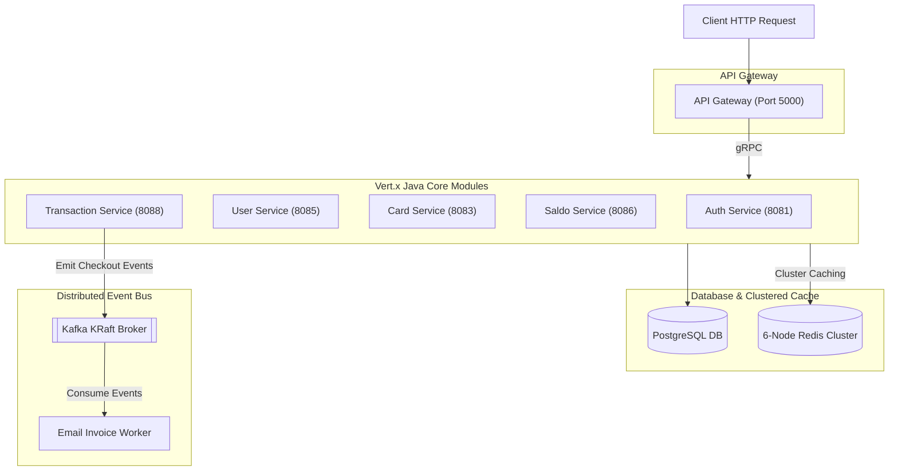
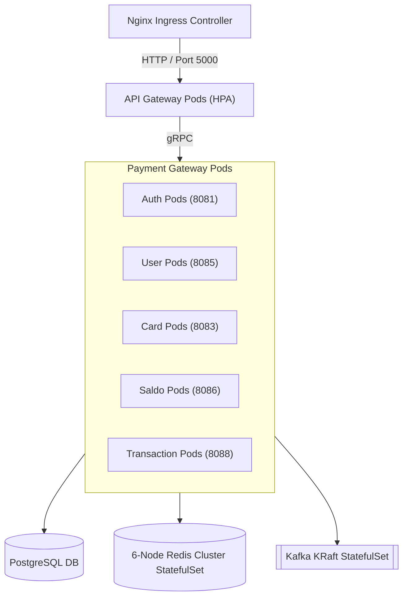

# Distributed Modular Monolith Payment Gateway (Vert.x Java 21)

This repository contains the implementation of a high-performance **Distributed Modular Monolith Payment Gateway**. The architecture is engineered to provide a secure, highly scalable, and modular backend for managing financial transactions, merchant operations, card management, and settlement workflows using **Eclipse Vert.x 4.5.24** and **Java 21**.

Unlike traditional monolithic applications, this system is organized into strictly isolated, well-defined domain modules. Internal communication is handled via strongly-typed, low-latency **gRPC** calls, while external REST API traffic is managed through a unified **API Gateway**. Asynchronous, event-driven workflows (such as email invoice notifications and settlements) are driven by events published to **Apache Kafka**.

---

## Key Features

*   **Role-Based Authentication and Authorization**
    *   Secured JWT-based token authentication.
    *   Granular Role-Based Access Control (RBAC) (Admin, Merchant, Customer, System).
    *   High-speed, cluster-wide session and permission lookups via **Redis Cluster**.
*   **Card and Balance Management**
    *   Full card lifecycle management, registration, and activation.
    *   Consistent financial ledger calculations scoped under the **Saldo Service**.
*   **High-Volume Transaction Processing**
    *   Comprehensive support for payment creation, processing, settlement, and refunds.
    *   Real-time transaction confirmations delivered asynchronously via **Email Service**.
*   **Unified API Gateway**
    *   Single external HTTP/REST gateway entry point routing request payloads to internal gRPC microservice stubs.
*   **Advanced Event-Driven Backbone**
    *   Decoupled cross-service communication using **Apache Kafka** running in modern, self-managed **KRaft** mode.
*   **Robust Observability Stack**
    *   Distributed tracing using **OpenTelemetry** exported to **Jaeger**.
    *   Metrics collection with **Prometheus** mapped to gorgeous **Grafana** dashboards.
    *   Centralized logging with **OTel Log Bridge** forwarding app logs directly to **Grafana Loki**.

---

## 📂 Project Structure

The project is managed as a Maven reactor multi-module structure, maintaining strict logical boundaries:

```
vertx-payment-gateway/
├── common/             ← Shared configurations, caching utilities, and OTel logger bridge
├── proto/              ← Shared Protobuf definitions (.proto files) and generated gRPC stubs
├── apigateway/         ← Vert.x Web Gateway (REST API routing entry point)
├── auth/               ← Authentication & JWT lifecycle management
├── user/               ← User profile registries & operations
├── role/               ← User roles & granular system permissions
├── card/               ← Credit/Debit card registration & operations
├── saldo/              ← Ledger balance & accounting calculations
├── merchant/           ← Merchant onboarding and document processing
├── transaction/        ← Core payment processing, settlements, & refunds
├── transfer/           ← Peer-to-peer and merchant funds transfer
├── topup/              ← Account funding workflows
├── withdraw/           ← Funds withdrawal management
└── email/              ← Kafka-driven asynchronous notification worker
```

---

## 🛠️ Active Service Module Directory

The system is structured as isolated reactive modules running on dedicated internal ports:

| Service Name | API Protocol | Internal Port | Description |
| :--- | :--- | :--- | :--- |
| **`apigateway`** | HTTP / REST | `5000` | Unified API entry point; routes REST payloads to internal gRPC stubs. |
| **`auth`** | gRPC | `8081` | Handles token creation, authentication, and token validation. |
| **`role`** | gRPC | `8082` | Scope-based access management and authorization checking. |
| **`card`** | gRPC | `8083` | Manages customer card registries. |
| **`merchant`** | gRPC | `8084` | Merchant onboarding status and corporate document processing. |
| **`user`** | gRPC | `8085` | User accounts, profiles, and configuration settings. |
| **`saldo`** | gRPC | `8086` | Real-time balance queries and arithmetic adjustments. |
| **`topup`** | gRPC | `8087` | Funding methods and balance top-ups. |
| **`transaction`** | gRPC | `8088` | Creates transaction records, payment statuses, and refunds. |
| **`transfer`** | gRPC | `8089` | Processes P2P and merchant settlement payouts. |
| **`withdraw`** | gRPC | `8090` | Cash withdrawals from balances. |
| **`email`** | Kafka Consumer | `8080` | Background consumer that dispatches transaction invoices via SMTP. |

---

## 💻 Tech Stack

*   **Java 21 (Temurin JDK)**: Core programming runtime environment.
*   **Eclipse Vert.x 4.5.24**: Reactive, non-blocking asynchronous toolkit.
*   **gRPC Java & Protobuf v3**: High-performance internal RPC protocols.
*   **PostgreSQL 17**: Main structured relational database.
*   **Flyway**: Automated database schema migrations executed upon service startup.
*   **Redis Cluster (v7.4)**: Sharded high-availability caching layer (3 Masters, 3 Replicas).
*   **Apache Kafka (KRaft mode)**: Next-generation Zookeeper-less distributed event log.
*   **OpenTelemetry**: Standardized metrics, tracing, and structured log aggregation.
*   **Grafana Loki / Prometheus / Jaeger**: High-fidelity observability dashboards.
*   **Docker & Docker Compose**: Isolated local development orchestration.
*   **Kubernetes**: Enterprise production cloud orchestration with HPAs.

---

## 🗺️ Deployment Topology

### 1. Local Compose Topology (Docker Compose)

In development, services boot concurrently alongside a 6-node Redis Cluster and Zookeeper-less Kafka instance:



### 2. Kubernetes Production Topology

On Kubernetes, the architecture operates securely under the `payment-gateway` namespace, scaling dynamically with Horizontal Pod Autoscalers (HPAs). Pods leverage gRPC TCP probes for proactive health checks, and Redis runs as a high-availability StatefulSet:



---

## Local Development Quickstart

### Prerequisites
Make sure your development machine has the following tools installed:
*   **Java 21 JDK** (Eclipse Temurin recommended)
*   **Maven 3.9+**
*   **Docker & Docker Compose**

### 1. Clone the Repository
```bash
git clone https://github.com/MamangRust/modular-monolith-vertx-payment-gateway.git
cd modular-monolith-vertx-payment-gateway
```

### 2. Compile Java Source Code (Maven Reactor)
Compile Protobuf definitions and build Java classes:
```bash
mvn clean compile
```

### 3. Build Container Images
Use the centralized build script to compile the backend container images:
```bash
chmod +x build-docker-images.sh
./build-docker-images.sh
```

### 4. Boot up the Local Cluster
Start Postgres, Zookeeper-less Kafka, the 6-node Redis Cluster, and all 11 Java backend modules:
```bash
docker compose -f deployments/local/docker-compose.yml up -d
```
*Note: The Redis Cluster will automatically configure and initialize itself upon boot via the `redis-cluster-init` container.*

### 5. Stop the Cluster
To halt all running containers and flush local volume states:
```bash
docker compose -f deployments/local/docker-compose.yml down -v
```

---

## Production Kubernetes Deployment

All production-grade Kubernetes resource definitions are configured under `deployments/kubernetes/`.

### 1. Boot up Namespace and Configurations
```bash
kubectl apply -f deployments/kubernetes/namespace.yaml
kubectl apply -f deployments/kubernetes/secret.yaml
kubectl apply -f deployments/kubernetes/configmaps.yaml
```

### 2. Launch Shared Infrastructure
```bash
# Deploy Postgres
kubectl apply -f deployments/kubernetes/postgres-pvc.yaml
kubectl apply -f deployments/kubernetes/postgres-deployment.yaml
kubectl apply -f deployments/kubernetes/postgres-service.yaml

# Deploy Kafka in Zookeeper-less KRaft Mode
kubectl apply -f deployments/kubernetes/kafka-pvc.yaml
kubectl apply -f deployments/kubernetes/kafka-deployment.yaml
kubectl apply -f deployments/kubernetes/kafka-service.yaml

# Deploy Redis Cluster (6 StatefulSet Pods + Headless/Cluster Services)
kubectl apply -f deployments/kubernetes/redis-cluster-configmap.yaml
kubectl apply -f deployments/kubernetes/redis-cluster-service.yaml
kubectl apply -f deployments/kubernetes/redis-cluster-statefulset.yaml

# Auto-Initialize Redis Cluster
kubectl apply -f deployments/kubernetes/redis-cluster-init-job.yaml
```

### 3. Deploy Payment Gateway Microservices
```bash
# API Gateway
kubectl apply -f deployments/kubernetes/apigateway-deployment.yaml
kubectl apply -f deployments/kubernetes/apigateway-service.yaml
kubectl apply -f deployments/kubernetes/apigateway-hpa.yaml

# Core Business Pods
kubectl apply -f deployments/kubernetes/auth-deployment.yaml
kubectl apply -f deployments/kubernetes/auth-service.yaml
kubectl apply -f deployments/kubernetes/user-deployment.yaml
kubectl apply -f deployments/kubernetes/user-service.yaml
kubectl apply -f deployments/kubernetes/role-deployment.yaml
kubectl apply -f deployments/kubernetes/role-service.yaml
kubectl apply -f deployments/kubernetes/card-deployment.yaml
kubectl apply -f deployments/kubernetes/card-service.yaml
kubectl apply -f deployments/kubernetes/merchant-deployment.yaml
kubectl apply -f deployments/kubernetes/merchant-service.yaml
kubectl apply -f deployments/kubernetes/saldo-deployment.yaml
kubectl apply -f deployments/kubernetes/saldo-service.yaml
kubectl apply -f deployments/kubernetes/topup-deployment.yaml
kubectl apply -f deployments/kubernetes/topup-service.yaml
kubectl apply -f deployments/kubernetes/transaction-deployment.yaml
kubectl apply -f deployments/kubernetes/transaction-service.yaml
kubectl apply -f deployments/kubernetes/transfer-deployment.yaml
kubectl apply -f deployments/kubernetes/transfer-service.yaml
kubectl apply -f deployments/kubernetes/withdraw-deployment.yaml
kubectl apply -f deployments/kubernetes/withdraw-service.yaml

# Event Consumer Worker
kubectl apply -f deployments/kubernetes/email-deployment.yaml
```

---

## System Observability

The platform leverages **OpenTelemetry** Logback bridges and tracers for comprehensive telemetry data:
*   **Distributed Tracing**: View full end-to-end trace flows across asynchronous gRPC boundaries in **Jaeger**.
*   **Centralized Logs**: Search and filter structured logs from all microservices inside **Grafana Loki**.
*   **System Metrics**: Check JVM memory graphs, thread counts, and transaction statistics inside **Grafana dashboards**.
